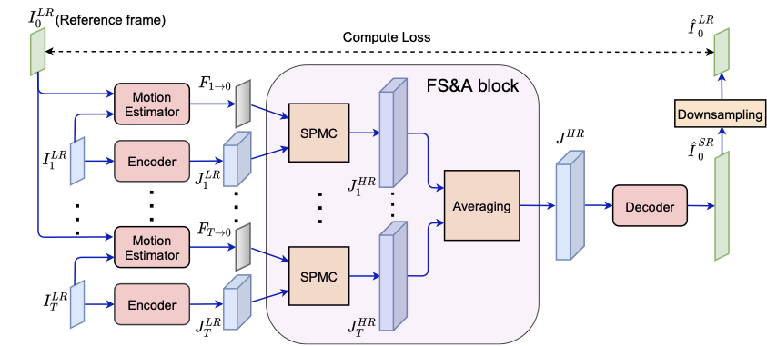

## Self-supervised multi-image super-resolution for push-frame satellite images

### CVPR 2021 - Earthvision Workshop

#### Ngoc Long Nguyen, Jérémy Anger, Axel Davy,  Pablo Arias, and Gabriele Facciolo

-------------------

#### Abstract 
Recent constellations of optical satellites are adopting multi-image super-resolution (MISR) from bursts of push-frame images as a way to increase the resolution and reduce the noise of their products while maintaining a lower cost of operation. Most MISR techniques are currently based on the aggregation of samples from registered low resolution images. A promising research trend aimed at incorporating natural image priors in MISR consists in using data-driven neural networks. However, due to the unavailability of ground truth high resolution data, these networks cannot be trained on real satellite images. In this paper, we present a framework for training MISR algorithms from bursts of satellite images without requiring high resolution ground truth. This is achieved by adapting the recently proposed frame-to-frame framework to process bursts of satellite images. In addition we propose an architecture based on feature aggregation that allows to fuse a variable number of frames and is capable of handling degenerate samplings while also reducing noise. On synthetic datasets, the proposed self-supervision strategy attains results on par with those obtained with a supervised training. We applied our framework to real SkySat satellite image bursts leading to results that are more resolved and less noisy than the L1B product from Planet.

[[pdf](https://openaccess.thecvf.com/content/CVPR2021W/EarthVision/papers/Nguyen_Self-Supervised_Multi-Image_Super-Resolution_for_Push-Frame_Satellite_Images_CVPRW_2021_paper.pdf)]  [[supp](https://openaccess.thecvf.com/content/CVPR2021W/EarthVision/supplemental/Nguyen_Self-Supervised_Multi-Image_Super-Resolution_CVPRW_2021_supplemental.pdf)]

### Data

[Dataset of Skysat L1A stacks](https://github.com/centreborelli/DSA-Self/releases/download/v1/DSA-Self-real-L1A-dataset.zip)

